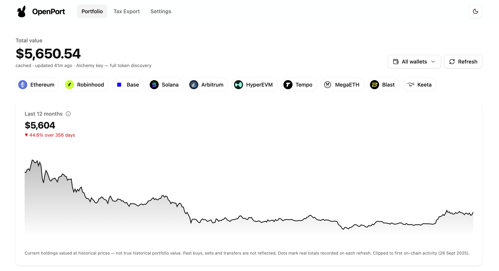
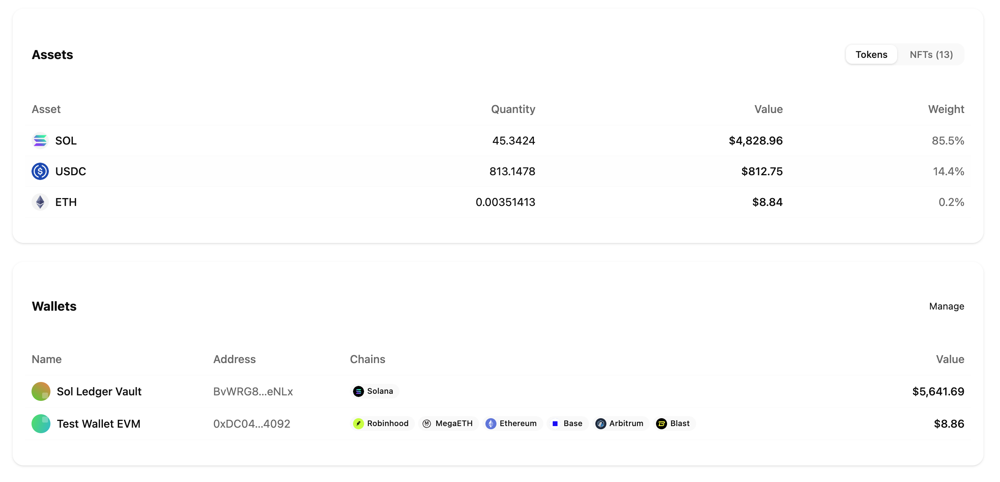

<div align="center">

# OpenPort

**A personal multi-chain portfolio manager that runs entirely in your browser.**

Track what you own across eleven networks. No account, no backend, no API key required.

**[→ Try it live at openport.ehlabs.xyz](https://openport.ehlabs.xyz)**

[](LICENSE)


</div>

---



## What it does

Paste in the addresses you want to watch, name them, and OpenPort shows you what they're
worth — combined, or one wallet at a time.

- **Total value in USD** across every wallet and chain you've added
- **Per-asset breakdown** with live prices and logos
- **NFTs** (ERC-721 / ERC-1155) alongside your tokens
- **Chain filters** — click a logo to scope the whole page to that network
- **12-month chart** with a hover readout
- **Tax export** — pull a wallet's history and download it as CSV
- **Light and dark** themes



## Why it's different

**It costs almost nothing to run.** One `Multicall3` batch per chain covers every token for
every wallet at once, so cost scales with *how many chains you use*, not how big your
portfolio is. Prices and token logos arrive in a single CoinGecko call. Refresh is a button,
never a background poll, and results are cached — reopening the app makes no network calls at
all. A typical setup sits comfortably inside a free Alchemy tier, or skips Alchemy entirely.

**It won't lie to you.** A chain that fails to load is shown as failed, never as `$0`. A total
built from incomplete data says so. Assets without a price show their quantity rather than a
made-up value. The 12-month chart is honest about being an approximation, and clamps itself to
the date your wallet first appeared on-chain instead of drawing a year of fiction for a wallet
you created last week.

**It can't touch your funds.** Addresses only. There is no signing path, no wallet connection,
and no private key input anywhere in the codebase.

## Supported networks

| Network | Chain ID | Type | Public RPC works |
|---|---:|---|:--:|
| Ethereum | 1 | EVM | ✅ |
| Robinhood Chain | 4663 | EVM (Arbitrum L2) | ✅ |
| Base | 8453 | EVM | ✅ |
| Solana | — | SVM | ✅ |
| Arbitrum One | 42161 | EVM | ✅ |
| Hyperliquid HyperEVM | 999 | EVM | ✅ |
| Hyperliquid HyperCore | — | native L1 | ✅ |
| Tempo | 4217 | EVM | ✅ |
| MegaETH | 4326 | EVM | ✅ |
| Blast | 81457 | EVM | ✅ |
| Keeta | — | custom | ✅ |

Every endpoint shipped by default was tested from a browser. Endpoints that look healthy but
send no CORS headers are useless to a client-side app, so they aren't included.

> **Note:** Hyperliquid is read twice, because it is two systems sharing one address.
> **HyperEVM** is the EVM execution layer; **HyperCore** is the native L1 holding your spot
> balances and perps account, which is invisible to `eth_call` and needs Hyperliquid's own API.
> Both are keyless.

> **Note:** Robinhood Chain is Robinhood's Ethereum-compatible L2 for tokenised real-world
> assets. It is not the Robinhood brokerage, and OpenPort has no connection to any brokerage
> account.

## Quick start

```bash
git clone https://github.com/ivaavimusic/openport.git
cd openport
npm install
npm run dev
```

Open <http://localhost:3000>, go to **Settings**, and add a wallet address. That's it — no key,
no signup.

Prefer not to run it yourself? The same build is hosted at
**<https://openport.ehlabs.xyz>** — it's the identical client-side app, so your
wallets and keys still never leave your own browser.

### Optional: add an Alchemy key

OpenPort works without one. Adding a [free Alchemy key](https://alchemy.com) in **Settings**
unlocks:

| | Without a key | With a key |
|---|---|---|
| Token balances | Major tokens only (curated list) | Every token you hold |
| Solana SPL tokens | ✗ public nodes refuse the lookup | ✅ |
| NFTs | ✗ needs an indexer | ✅ |
| EVM tax export | MegaETH only | All EVM chains |
| Wallet age (chart clamp) | Solana only | All chains |

If you add a key, enable the networks you want in your [Alchemy
dashboard](https://dashboard.alchemy.com/) — they're off by default per app, and OpenPort will
tell you which ones are switched off.

### Custom RPC endpoints

Settings → **RPC endpoints**. Each network has a list you can extend with `+`. Your own
endpoints are tried first, then Alchemy, then the public fallbacks, with automatic failover
down the list.

## How your data is handled

Everything lives in your browser's `localStorage`. There is no server, no database, no
telemetry, and no account.

- Wallet addresses, names, RPC endpoints and cached balances stay on your machine
- **Export/Import JSON** in Settings moves your config between browsers
- Requests go only to the RPC endpoints and price APIs listed above

One honest caveat: an Alchemy key in `localStorage` is readable by any script running on the
page. That's normal for a personal tool on your own machine, but don't paste a key with
billing scope you care about. Since public RPCs are the default, most people never enter one.

## Tax export

The **Tax Export** tab fetches a single wallet's history and downloads it as a CSV with
`Date, Asset, Amount, Fee, P&L, Payment Token, ID, Notes, Tag, Transaction Hash`.

Solana uses signature history with balance-delta accounting, so swaps and multi-instruction
transactions come out right. MegaETH uses Blockscout. Other EVM chains use Alchemy's transfer
API. Where a source doesn't report fees, the UI says "Not reported" rather than showing `0` as
if you paid no gas.

## Tech stack

Next.js 16 (App Router, Turbopack) · React 19 · TypeScript · Tailwind CSS 4 · shadcn/ui ·
viem · CoinGecko · Alchemy (optional)

## Deploying

It's a static Next.js app — any host works.

```bash
npm run build && npm start
```

For Vercel: import the repo and deploy. No environment variables are needed; keys are entered
by each user in their own browser.

The official instance runs at <https://openport.ehlabs.xyz>.

## Contributing

Issues and pull requests are welcome.

**Adding a network** is usually a single entry in [`src/lib/chains.ts`](src/lib/chains.ts). If
it's EVM with Multicall3 deployed, balances work immediately. Please verify the public RPC is
callable from a browser (CORS) before adding it — an endpoint that only works from `curl`
doesn't help here.

```bash
npm run dev       # dev server
npm run build     # production build
npm run lint      # eslint
npx tsc --noEmit  # typecheck
```

## Known limitations

These are real, and deliberately visible in the UI rather than hidden:

- **The chart is an approximation.** It values *today's* holdings at past prices, so it ignores
  every historical buy, sell and transfer. Real totals are recorded on each refresh and
  overlaid as dots, so accuracy improves the longer you use it.
- **Keeta balances** aren't in the portfolio yet — Keeta works in Tax Export only.
- **Tempo's native asset is unpriced.** Its gas token isn't clearly documented, so it shows a
  quantity rather than an invented value.
- **Solana NFTs** aren't supported yet (that needs Alchemy's DAS API).
- **NFTs are capped** at 100 per wallet per chain.

## License

MIT — see [LICENSE](LICENSE).

<div align="center">

Built by [EventHorizon Labs](https://ehlabs.xyz)

</div>
